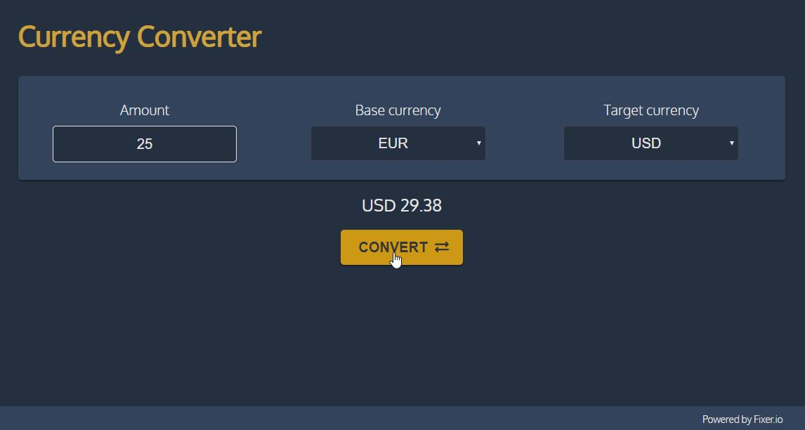
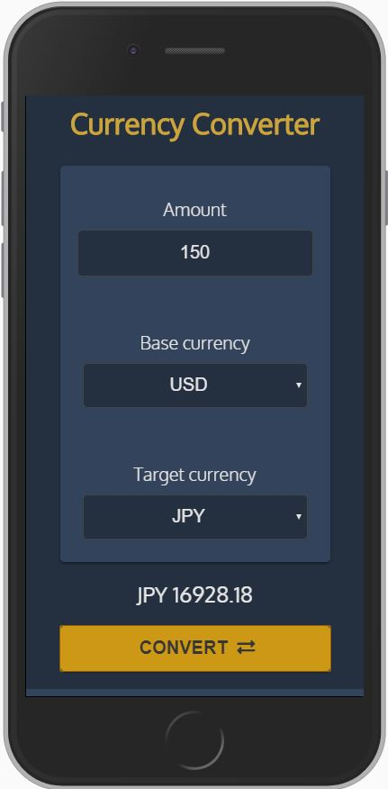

# Currency Converter
  

**Developed using**
  
HTML5 
CSS 
VanillaJS 
Fixer.io API 

**Instructions for testing**
 
1) Clone the project;
2) Sign up on Fixer.io and get your Free API Key for testing;
3) Open scripts.js and add your key, save the file;
4) Open index.html.

 

**UI**

  

  

